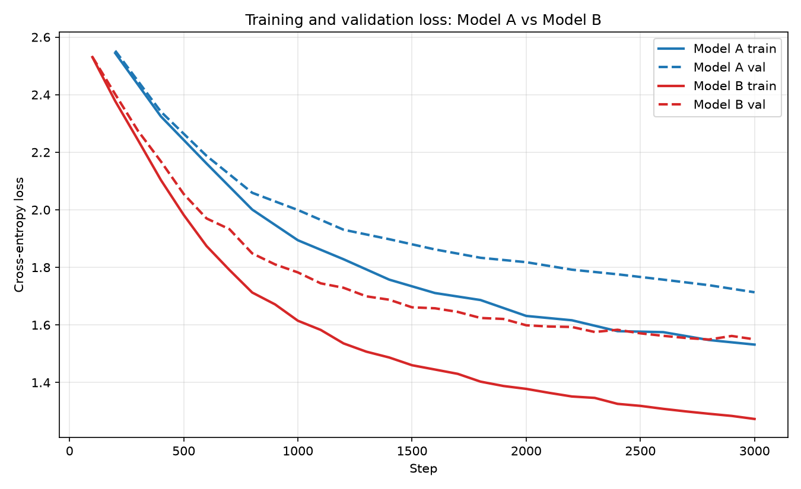

# Tiny Shakespeare Transformer Comparison

This project trains and evaluates two byte-level, GPT-style PyTorch transformers on Tiny Shakespeare: a 470K-parameter baseline (Model A) and a 3.32M-parameter scaled model (Model B). It includes reproducible data preparation and training pipelines, held-out loss and perplexity benchmarking, loss-curve visualization, and a qualitative comparison against Gemini Flash.

## Install

```bash
pip install -r requirements.txt
```

## Reproduce

Run each command from the repository root:

```bash
# 1. Download, tokenize, and split Tiny Shakespeare.
python my-transformer/data/prepare.py

# 2. Train Model A.
python my-transformer/train.py model_a

# 3. Train Model B.
python my-transformer/train.py model_b

# 4. Compute held-out metrics and regenerate loss_curves.png.
python evaluation/benchmark.py

# 5. Generate the three-model qualitative comparison.
python evaluation/gemini_compare.py
```

## Final metrics

| Model | Parameters | Final train loss | Held-out val loss | Perplexity |
|---|---:|---:|---:|---:|
| Model A | 470,528 | 1.5317 | 1.7176 | 5.57 |
| Model B | 3,323,392 | 1.2733 | 1.5532 | 4.73 |

The validation loss and perplexity values above are recomputed over the held-out validation set by `evaluation/benchmark.py`.

## Gemini API key

Set `GEMINI_API_KEY` in a local `.env` file before running `evaluation/gemini_compare.py`:

```dotenv
GEMINI_API_KEY=your_api_key_here
```

The `.env` file is ignored by Git and must not be committed.
